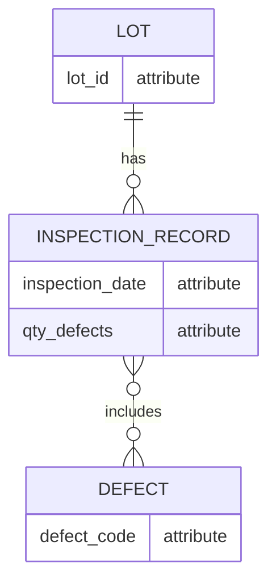

# This is a demo showing how to embed mermaid.js code in md
## InspectionRecords 
inspection_date qty_defects 
## Lot 
lot_id 
## Defect 
defect_code 
## Relationships 
One lot can have many inspection records 

One defect can exist in many inspection records

# ERD Diagram

